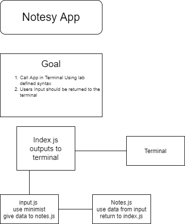

# notes
notesy labs

# LAB - Class 01

## Project: Notesy

### Author: Brendon

### Links and Resources

- [submission PR](https://github.com/brendon-401-advanced-javascript/notes/pull/2)
- [ci/cd](https://github.com/brendon-401-advanced-javascript/notes/actions) (GitHub Actions)
- [back-end server url](http://xyz.com) (when applicable)
- [front-end application](http://xyz.com) (when applicable)

### Setup

#### `.env` requirements (where applicable)

#### How to initialize/run your application (where applicable)

--TO RUN THE APPLICATION--
- In the Terminal run 
    - **node index.js --add 'any note you want to save'** then press enter.

#### How to use your library (where applicable)

#### Tests

- How do you run tests?
- Any tests of note?
- Describe any tests that you did not complete, skipped, etc

#### UML

Link to an image of the UML for your application and response to events

